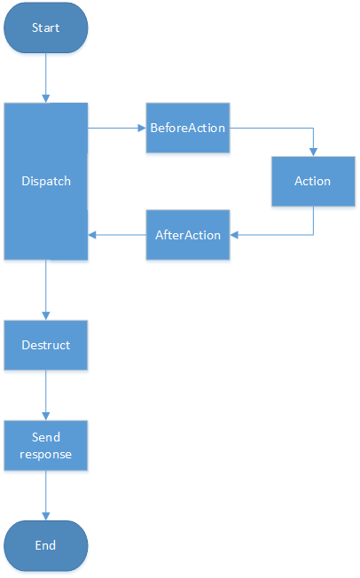

.. _controller:

controller
=============
服务端简单MVC的实现，实现了Handler接口，相当于一个重新实现的ServeMux

.. contents:: 目录

ServeHTTP简单流程
------------------

重要数据结构
--------------

RemoteAddr
^^^^^^^^^^^

::

    type RemoteAddr struct {
        Ip   string
        Port string
    }

Context
^^^^^^^^^^^^

::

    import (
        "net/http"
        "net/url"
    )

    type Context struct {
        Req        *http.Request
        RespWriter http.ResponseWriter

        QueryValues *url.Values
        TransData   map[string]interface{}        //这个结构体用于在beforeAction、actionFunc、afterAction中传递需要的信息
        RespBody    []byte                        //响应体内容放入这个结构中即可

        RemoteRealAddr *RemoteAddr                //go-server通常放到nginx后做proxy_pass，真实的用户ip、port放到这里
        Rid            []byte                     //每个请求一个request_id，可以作为logId使用，这里并没有做加密
    }

ActionFunc
^^^^^^^^^^^^^

::

    type ActionFunc func(context *Context, args []string)

JumpFunc
^^^^^^^^^^^^^

::

    type JumpFunc func(context *Context, args ...interface{})

使用
--------

import
^^^^^^^^

::

    import (
        "andals/gobox/http/controller"
    )

添加action路由
^^^^^^^^^^^^^^^

::

        func (this *Controller) AddExactMatchAction(key string, f ActionFunc) *Controller  //request_uri严格匹配
        func (this *Controller) AddRegexMatchAction(pattern string, f ActionFunc) *Controller  //request_uri正则匹配

路由查找action说明：

1. 先检查严格匹配，顺序为规则添加时的顺序，找到直接作为最终结果返回。
#. 严格匹配没找到，则进行正则匹配，按照规则添加的顺序进行匹配，找到则最为最终结果返回。

添加beforeAction、afterAction
^^^^^^^^^^^^^^^^^^^^^^^^^^^^^^^^^

::

    func (this *Controller) AddBeforeAction(pattern string, af ActionFunc)
    func (this *Controller) AddAfterAction(pattern string, af ActionFunc)

查找对应actionFunc时，均使用request_uri通过正则匹配进行查找

设置action找不到时如何做
^^^^^^^^^^^^^^^^^^^^^^^^^^^^^^^^^

::

    func (this *Controller) SetMissActionFunc(jf JumpFunc)

添加destructFunc
^^^^^^^^^^^^^^^^^^^

destructFunc会在dispatch后执行，作为资源销毁、释放阶段，每个请求中会造成内存泄漏的临时资源可以在这里释放。

和afterAction的不同如下：

1. 例如redirect302这种跳过dispatch阶段的行为，依旧可以通过这个阶段释放资源。
#. 无法在这个阶段修改response。

::

    func (this *Controller) AddDestructFunc(pattern string, f DestructFunc) *Controller

直接返回302重定向
^^^^^^^^^^^^^^^^^^^^^^^^^^^^^^^^^

::

    func Redirect302(url string)

中断action的执行，跳转到指定方法执行
^^^^^^^^^^^^^^^^^^^^^^^^^^^^^^^^^^^^^^

::

    func LongJump(jf JumpFunc, args ...interface{})

Demo
---------

::

    import (
        "andals/gobox/http/controller"
        "andals/gobox/http/gracehttp"
        "andals/gobox/misc"
    )

    func main() {
        cl := controller.NewController()

        cl.AddBeforeAction("^/exact", beforeAction)
        cl.AddAfterAction("^/([a-z]+)[0-9]+", afterAction)

        cl.AddExactMatchAction("/exact", exactAction)
        cl.AddRegexMatchAction("^/[a-z]+([0-9]+)", regexAction)

        gracehttp.ListenAndServe(":8001", cl)
    }

    func beforeAction(context *controller.Context, args []string) {
        context.RespBody = []byte("exact before")
    }

    func exactAction(context *controller.Context, args []string) {
        context.RespBody = misc.AppendBytes(context.RespBody, []byte(" exact "))
    }

    func regexAction(context *controller.Context, args []string) {
        context.RespBody = misc.AppendBytes(context.RespBody, []byte(" regex id = "+args[0]+" "))
    }

    func afterAction(context *controller.Context, args []string) {
        context.RespBody = misc.AppendBytes(context.RespBody, []byte("after "+args[0]+"\n"))
    }
