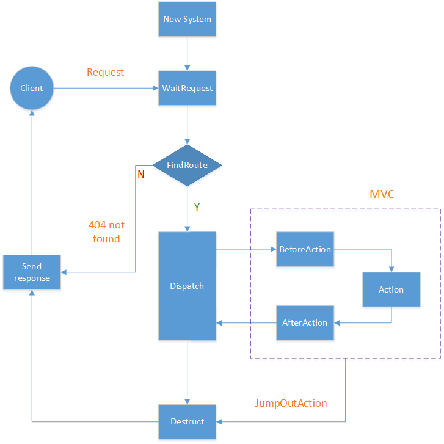

.. _http-server:

http-server相关
====================

.. toctree::
    :maxdepth: 2

    gracehttp
    controller
    router
    system

http-server的处理流程
------------------------------

如何构建一个http-server
------------------------------

#. 创建controller
#. 创建router，添加路由项
#. 创建system
#. gracehttp.ListenAndServe(addr, system)

示例::

    dcl := new(DemoController)
    r := router.NewSimpleRouter()

    r.DefineRouteItem("^/g/([0-9]+)$", dcl, "get")
    r.MapRouteItems(new(IndexController), dcl)

    sys := system.NewSystem(r)

    gracehttp.ListenAndServe(":8001", sys)
